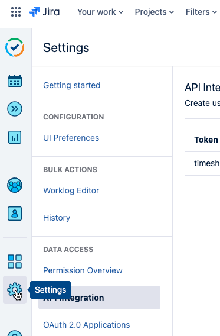

## Tempo Work Log

twl write all Jira/Tempo Worklogs on the screen.
This tool is for a quick overview of the worklogs.

Example:

```txt
twl --project WORLD
From: 2024-04-22, To: 2024-04-28
Project Key,	 User,	Date,	Issue, 	Time Spent,	 Billable	Description
WORLD,	john@doe.de,	2024-04-22,	15751,	1.50,	1.50,	Deploy Dev
WORLD,	john@doe.de,	2024-04-23,	15761,	3.50,	3.50,	Implement Sorting
WORLD,	jane@doe.de,	2024-04-23,	15751,	1.00,	1.00,	Testing API
WORLD,	john@doe.de,	2024-04-25,	15761,	3.00,	3.00,	Meetings
SumSpent: 9.00, SumBillable: 9.00
```

# Parameters

| Parameter | Description                  |
| --------- | ---------------------------- |
| period    | "week", "month", "lastmonth" |
| project   | Project key                  |

## Usage

```bash
twl --period week --project WORLD
```

Get all entries for the current week for the project WORLD

## Install

2024/04/23 18:02:46 Error loading .env file: /Users/jdoe/.tempoworklog

Create the file `~/.tempoworklog` with the following content:

| Variable        |  Content                 |  example                        |
| --------------- | ------------------------ | ------------------------------- |
| JIRA_URL        | Url of the jira instance |   "https://name.atlassian.net/" |
| JIRA_USER       | User email               |   "john@doe.de"                 |
| JIRA_PASSWORD   | Jira token               |   "ATBoy\*\*\*"                 |
| TEMPO_API_TOKEN |  Tempo token             |   "sometoken-eu"                |
| TEMPO_BASE_URL  | Tempo API url            | "https://api.tempo.io/4"        |

Use `envexample`as a base.

### Get Jira Password/Token

1. Jira settings
   
2. Atlassian account settings
   
3. Security
4. Create and manage API tokens
5. Create API token
6. Save as `JIRA_PASSWORD` in `~/.tempoworklog`

### Get Tempo API Token

1. Tempo settings
   
2. API Integration
   
3. Create API token
4. Save as `TEMPO_API_TOKEN` in `~/.tempoworklog
